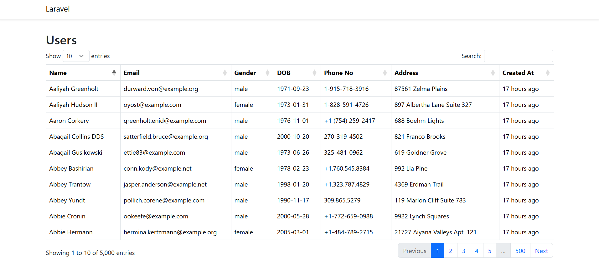

# Installation

1. Clone the repository
2. Run `composer install`
3. Copy `.env.example` and rename it `.env`
4. Set up your database credentials in `.env`
5. Run `php artisan migrate` to create the tables
6. Run `php artisan db:seed` to create fake data
7. Run `php artisan serve` to start the development server

